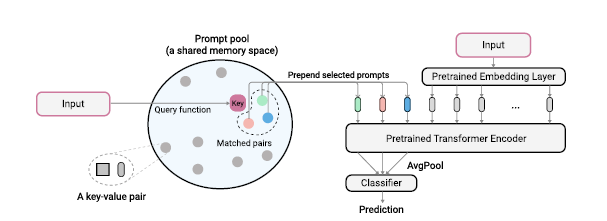
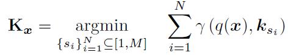
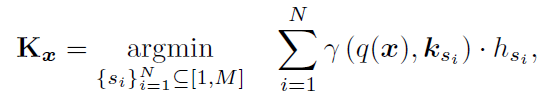
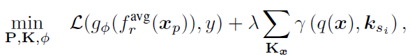
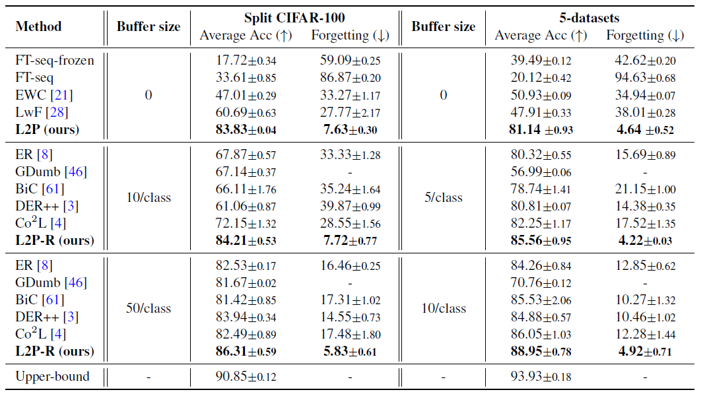
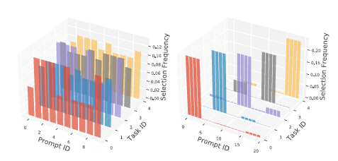

# Learning to Prompt for Continual Learning

[Learning to Prompt for Continaul Learning](https://arxiv.org/abs/2112.08654)

# Introduction

- Learning to Prompt for Continual Learning (L2P)는 Continual Learning의 문제를 Prompt를 이용해 해결한 방식이다.
- Prompt는 NLP분야에서 사전 학습된 Large Language Model (LLM)을 특정 Task에 대해 Tuning해 주기 위해 사용되었다.
- NLP 분야에서 시작된 Transformer 모델이 컴퓨터 비전에도 적용되며 Prompt 또한 컴퓨터 비전에 적용 할 수 있게 되었다.
- Prompt의 학습 방식 자체가 기존 사전 학습된 모델의 파라미터는 변하지 않기 때문에 Continual Learning에 적용되기 적합하다.

- 이 논문에서는 사전 학습된 ViT 모델은 고정시키고 Prompt Pool이라는 특별한 파라미터들 만을 학습하여 기존 Task에 대한 성능은 유지하며 새로운 Task에 대한 성능을 최대한 늘린다.

# Previous Methods

- Continual Learning을 위한 기존 방식들은 학습된 모델의 파라미터 전부 또는 일부를 학습한다.

- 여기서 기존 Task에 대한 성능을 유지하기 위해 크게 Rehearsal Buffer를 사용하는 방식과 Known Task Identity at Test Time를 가정하여 별도의 Head를 학습하는 방식이 있다.

- 하지만, 이 두가지 방식 모두 현실 세계에 적용하기에 어려움이 존재한다.

- Rehearsal Buffer 방식은 이전 Task에 대한 데이터를 필요로한다. 하지만 실제로 data privacy 문제, 데이터 보관 비용 문제 때문에 문제가 생긴다.

- Known Task Identity at Test Time 방식은 inference시에 어떤 Task인지 알고 있다고 가정을 한다. 하지만 실제 inference시에 Task Identity를 모르는 경우에 이 방법을 적용 할 수 없다.

# L2P

L2P는 위의 두가지 방식을 사용하지 않고 Continual Learning의 문제를 해결하려 한다.

- Rehearsal Buffer의 문제

  - Prompt는 사전 학습된 모델을 학습 할 필요 없다는 점에서 이전 Task에 대한 성능을 유지 하는데에 아주 효율적이라고 할 수 있다. Prompt를 사용하는 방식을 통해 기존 모델의 파라미터를 건들이지 않고 각 Task에 맞는 Task-Specific한 Prompt를 학습한다.
  - 사전 학습된 모델의 파라미터가 변경되지 않는 특성이 Rehearsal Buffer 없이도 효율적으로 이전 Task의 성능을 유지 할 수 있게 된다.

- Task Identity

  - 단순히 Prompt만을 사용한다면 Task Identity 문제를 해결 할 수 없다. 따라서 L2P에서는 Prompt Key를 사용하여 해결한다. Prompt는 Prompt Pool이라는 곳에 보관이 되며 각 Prompt는 Key-Value 값으로 구성된다. 입력 데이터가 들어오게 Prompt Query를 계산하여 Prompt Key값을 선택하게 되고 Prompt의 Value 값으로 학습을 진행하게 된다.

  - 이 때 Prompt Key 또한 학습이 되는 파라미터이다.

  - 이 방식을 사용하여 Test Time에 Task Identity에 대해 알지 못하더라도 Similarity를 통해서 해당 Task에 맞는 Prompt를 선택하게 해 줄 수 있다.
  - 이 방식을 사용하면 비슷한 Task 끼리 Prompt가 공유되어 Knowledge Sharing 이 가능하다.
    

# Details

### Prompt Pool

- Prompt Pool의 M개의 Prompt는 다음과 같이 정의된다

  $P = {P_1, P_2, ... , P_M}$

- 각 Prompt의 Dimension은 Prompt Length ($L_p$) \* Dimension ($D$)이다.

  $P_j \in \mathcal R^{L_p \times D}$

- Input 이미지 $x$에 대해 embedding feature는 $x_e = f_e(x)$ 이다.

- 따라서 Input Embedding은 다음과 같이 정의된다.

  $x_p = [P_{s_1}; ... ; P_{s_N};x_e]$

- Input Embedding $x_p$는 ViT 모델의 Transformer Encoder에 입력되게 된다.

### Prompt Query

- Prompt Query로는 Similarity를 사용 할 수 있다.

- 즉, Input과 Prompt Key간의 Similarity를 계산해 가장 비슷한 Prompt를 선택해준다.

- 다음과 같이 Query Function을 정의 할 수 있다.

  $\lambda : \mathcal R^{D_k} \times \mathcal R^{D_k} \rightarrow \mathcal R^{D_k}$

- 그렇다면 Prompt를 선택하는 식은 다음과 같아진다.

  

- 위의 식에서 $K_x$는 Input과 가장 비슷한 Top N개의 Prompt Key들이다.

- 이때 N이 위에이 언급한 Prompt Length이며 우리가 설정해 줄 수 있는 값이다.

- inference시에는 task identity에대해 모르는 경우가 많지만 Train시에는 대부분 알 수 있다. 따라서 Train시에는 Task 별로 다양한 Prompt가 선택되도록 유도 할 수 있다.

- 이 때, 각 Task 별로 Prompt Frequency 테이블 $H_t = [h_1, h_2, ..., h_M]$을 저장하고 새로운 Task를 학습시에 freqeuncy 만큼의 패널티를 주어 Task마다 더 다양한 Prompt를 선택하도록 유도 할 수 있다. 선택적으로 각 Task가 서로 다른 경우에 이 식을 Training 시에 적용 할 수 있다.

  

### Loss

- ViT 모델 학습시에 Loss는 다음과 같다.

  

- 가장 앞의 term은 사전 학습된 ViT 모델 $f_r^{avg}$ 와 final classifier $g_{\theta}$를 통해 cross-entorpy를 적용한 것을 의미한다.

- 그 뒤에 Prompt Key 선택택 위한 Query function을 loss로 설정하여 선택된 Key들을 학습한다.

# Experiments

### Task, Class, Domian-incremental, Task-agnostic

- 실험을 확인 하기 이전에 Continual Learning Setting의 종류에 대해서 알아야한다.

- Task-incremental learning은 가장 간단한 setting으로 test time에 task identity를 알고 있는 경우를 의미한다. 따라서 각 Task 별로 classification Head를 학습하고 inference시에 해당되는 Task에 대한 Head를 사용하면 된다. L2P의 경우 Unknown task identiy를 가정한 더 어려운 문제를 풀기 위한 방벙이기 때문에 Task-incremental learning에 대한 실험은 진행하지 않는다.

- Class-incremental learning은 Task-incremental learning에서 test time에 task identity를 모르는 경우를 의미한다. 이 setting에 대한 실험은 training시 특정 task에 대해 순차적으로 학습한다. Inference시에는 어떤 identity를 모르는 어떤 task떤 들어와도 처리 할 수 있어야한다.

- Domain-incremental learning은 task는 변하지 않고 input에 대한 도메인만 변하는 것을 의미한다.

- Task-agnostic learning의 경우 class-incremental learning과 유사하지만 task가 순차적으로 학습되는 것이 어느 task가 학습될지 모르는 경우를 의미한다. 따라서 Training시에 순차적으로 학습하는 것이 아닌 모든 task를 한 번에 학습한다.

- 이 실험은 class-incremental setting (uknown task identity at test time)에 대한 실험이다. CIFAR-100 데이터 셋을 10개의 Task로 나누어 실험한 것과 별개의 5개 데이터 셋을 하나의 Task로 실험한 결과이다.

- 위의 표에서 Upper Bound는 각 Task에 대해서만 Fine-Tuning을 진행한 것이다.

- 가장 위에 있는 Method들은 L2은 방식과 같이 Rehearsal Buffer를 필요로 하지 않는 방식들이다. L2P가 이런 방식 중 가장 높은 성능을 보여준다.

- 그 아래 Method들은 Rehearsal Buffer을 함께 사용 할 수 있는 방식들이다. L2P는 Rehearsal Buffer를 함께 사용 했을 때 더 좋은 성능을 보여준다.

- domain-incremental, task-agnostic setting에 대해서도 L2P는 더 좋은 성능을 보여준다. 자세한 결과는 해당 논문의 링크에서 확인 할 수 있다.

# Ablation Study

### Prompt Selection

- 위의 그림은 Split-CIFAR-100 (좌), 5-dataset (우) 데이터 셋에 대해 Prompt Frequency를 측정한 것이다.

- Split-CIFAR-100의 경우 하나의 데이터 셋 내에서 10개의 task가 나누어져 있기 때문에 각 task가 서로 비슷하다. 이 경우에 Prompt가 골고루 선택되는 것을 확인 할 수 있다.

- 5-dataset의 경우 서로 다른 5개의 dataset을 활용하는 것이기 때문에 task가 서로 다르다. 따라서 Prompt 또한 Task 별로 나눠지는 것을 확인 할 수 있다.

- 이 결과는 각 Task가 비슷할 경우 Knowledge sharing을 하고 서로 다른 경우에 share를 하는 경향성이 낮아지고 task-specific한 prompt가 학습된다.
