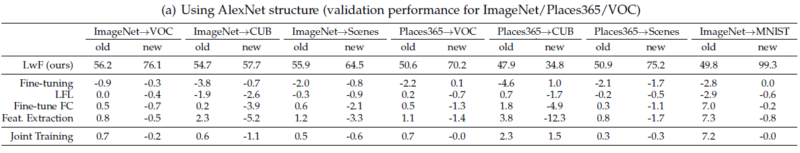
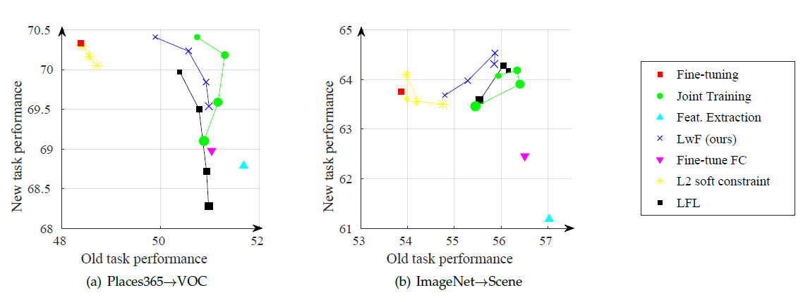
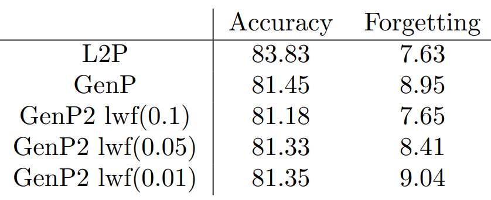

# Learning without Forgetting

학부연구생 프로젝트로 Prompt Tuning을 진행하며 Continual Learning setting에서 생성형 모델을 학습 시켜야 했다. Prompt의 경우 비슷한 task인 경우에만 동일한 prompt를 선택하도록 설계되었기 때문에 forgetting이 비교적 적게 일어나지만 생성형 모델과 같이 모델 자체를 학습하는 경우에는 forgetting이 많이 일어났다.

Forgetting을 줄여 주기 위해 가장 간단하면서 어느 모델에나 적용 할 수 있는 방법인 LwF (Learning without Forgetting)을 적용해 주었다.

# Continual Learning

**Continual Learning**은 **Catastropical Forgetting**을 해결하기 위한 방법론이다.

- Training Set a에 대해 학습된 모델 A가 있을 때, A에 새로운 Training set b를 학습 시키고 싶다.
- a를 보관하고 있다면 a+b로 새로운 데이터를 만들어 처음부터 학습 시키면 된다.
- 하지만 a가 없다면? c,d,e,f, … 계속해서 데이터가 추가된다면? **데이터를 보관하는 비용이 커진다**.
- 그래서 모델 A를 b에 대해서만 학습을 시키고 싶다. 하지만 이럴 경우 모델은 a를 고려하지 않고 b에 대해서만 학습되기 때문에 a에 대한 성능이 떨어지게 된다. (Catasropical Forgetting)

Continual Learning에서도 여러가지 상황에 따라 구분된다.

**Task-incremental**

- 새로운 task가 추가 될 때 마다 독립적인 classification head가 추가된다.
- inference time에 어떤 task인지를 알려주어 해당 classification head를 사용한다.

**Class-incremental**

- 새로운 class가 추가 될 때 마다 head를 class 수 만큼 늘려준다.
- 따라서 모든 class에 대해 하나의 head만을 가진다.
- inference time에 어떤 task인지를 모른다고 가정하기 때문에 더 어려운 문제이다.

# Previous Solutions

### **Fine-tuning**

새로운 task 마다 fine-tuning을 진행한다.

- 기존 모델 A 전체를 학습 시킬 수 있다.
- 혹은 Forgetting을 줄여주기 위해 일부 layer만을 학습 시킬 수 도 있다.

이 방법은 어떻게 하던 Forgetting을 피할 수 없다. Task 마다 학습된 모델을 저장하여 task에 따라서 선택하게 할 수 도 있겠지만 모든 task에 대한 모델을 저장하기에는 메모리 비용이 크며 inference시에 어떤 task인지 모르는 경우 적용 할 수 없다.

### **Feature Extraction**

기존의 모델 A에 A’ layer를 추가하여 해당 layer만 새로운 task에 대해 학습한다.

A는 고정되어 있기 떄문에 기존 task에 대한 지식은 잘 보존 되지만 새로운 task에 대한 성능의 한계가 있다.

### **Joint training**

모든 파라미터를 이전 task의 training data와 함께 학습한다

이 방식은 앞서 언급했던 것과 같이 이전 task에 대한 데이터를 보관해야 한다는 문제점이 있다.

privacy에 민감한 데이터의 경우 보관 할 수 없다는 문제 또한 있다.

# Learning without Forgetting (LwF)

Learning without Forgetting는 기존의 학습된 데이터는 사용하지 않고 새로운 task에 대한 데이터만 사용하여 기존의 학습 내용의 forgetting은 최소화하고 새로운 데이터의 accuracy는 최대화하는 것을 목표로 한다.

**LwF는 Computer Vision의 Classification task를 기반으로 실험하였으며 task-incremental setting을 가정하고 있다.**

LwF는 forgetting을 최소화하기 위해 새로운 task에 대해 이전 task로 학습된 모델을 이용하여 **output**을 먼저 계산한다.

그리고 새롭게 학습을 진행 할 때 이 **output**에 대한 결과를 유지하도록 regularization term을 추가해주는 방식이다.

이렇게 학습을 진행 할 경우 이전 task에 대한 accuracy를 어느 정도 보존 할 수 있다.

이 아이디어는 Fine-tuning과 distillation을 결합 한 방식으로 볼 수 있다.

<aside>
💡 Knowledge Distillation

Distillation은 성능이 좋고 파라미터 수가 많은 큰 모델의 지식을 작은 모델에 주입 시키는 방식이다.

Computation 성능이 좋지 않은 환경에서는 큰 모델을 사용 할 수 없기에 큰 모델과 같은 결과를 낼 수 있는 작은 모델을 학습하여 사용 할 수 있다.

작은 모델을 학습 할 때 각 class를 label로 학습하는 것이 아닌 큰 모델의 output logit을 soft label로 사용하여 학습 한다.

</aside>

따라서 LwF는 새로운 task를 학습하며 이전 task에 대한 knowledge distillation을 통해 이전 task에 대한 지식도 보존하도록 학습한다.

저자는 이전 task에 대한 지식을 보존하는 과정이 오히려 regularizer로 작용하여 새로운 task에 대한 성능이 좋아지는 경우도 있었다고 설명한다.

### **Terminology**

**LwF**는 기존 모델 A가 있을 때 모든 task에 대해 공유되는 부분과 task-specific한 부분으로 나눈다.

학습시에 공유되는 부분은 고정시키고 task-specific한 부분만 학습을 진행한다.

<aside>
💡 새로운 task : N

공유 파라미터 : $\theta_s$

task-specific 파라미터 : $\theta_o$

new task-specific 파라미터 : $\theta_n$

</aside>

새로운 task n에 대해 학습을 시킨 다는 것은 $\theta_o$ 를 학습해 $\theta_n$을 구하는 것이다.

### **Method**

방법은 간단하다.

<aside>
💡

1. N에 존재하는 이미지에 대해 기존 파라미터( $\theta_s$, $\theta_o$ )를 이용해 response $y_0$를 생성한다

컴퓨터 비전의 classificaiton의 경우 $y_0$는 각 label에 해당하는 logit값이다.

2. 새로운 파라미터 $\theta_n$을 initialize한다

3. $\theta_s, \theta_n$를 이용해 예측한 값을 $y_0$에 가까워지도록 학습한다

- 새로운 파라미터 ( $**\theta_s, \theta_n$\*\* )를 이용해 response $\hat y_0$를 생성한다.

- Loss에 $\mathcal L(y_0,\hat y_0)$를 추가한다.

</aside>

전체 **Loss**는 아래와 같다 (R은 weight decay를 의미)

$\mathcal L_{new}$는 일반적인 Cross-Entropy Loss를 사용하고

$\mathcal L_{old}$는 Knowledge Distillation에서 사용한 변형된 Cross-Entropy를 사용한다. (soft label)

$$
\mathcal Loss = \lambda_0  \mathcal{L}_{old} (Y_0, \hat Y_0) + \mathcal{L}_{new} (Y_{n}, \hat Y_{n}) + \mathcal R(\hat \theta_s, \hat \theta_o, \hat \theta_n)
$$

# Experiments

**Table 1. AlexNet 기반 Single new task scenario**

표1은 AlexNet을 기반으로 실험을 진행한 결과이다.

Single new task scenario : ImageNet → VOC 는 ImageNet으로 학습된 모델을 VOC 모델로 학습시키는 것을 의미한다.

Joint Training은 이전 task의 데이터를 사용하는 방식이기 때문에 이 실험의 upper bound로 설정되었다.

1. new task에 대해서 LwF가 대부분의 방식보다 좋은 성능을 보여준다.

   특히 Fine-tuning 방식 보다 더 좋은 성능을 보여주는 것은 regularization term이 이 후 task에 도움이 될 수 있음을 의미한다

2. old task에 대해서 fine-tuning이 가장 안 좋은 성능을 보이는 것을 알 수 있다. Fine-tuning은 shared parameter까지 학습하기 때문에 forgetting이 가장 많이 일어나기 때문이다.
   이전 task의 데이터를 사용하는 joint training의 경우 old task의 성능이 가장 잘 유지되는 것을 확인 할 수 있다.

Figure7. Visualization for both new and old task performance for compared methods, with different weight losses

위의 그림은 Loss에서 $\lambda_0$값을 어떻게 설정 하느냐에 따른 성능을 보여주고 있다.

$\lambda_0$얼마나 regularization을 많이 줄지를 설정해 줄 수 있다.

이 값이 작을 수록 old task에 대한 performance가 떨어지고 newtask에 대한 performance가 증가한다.

내가 진행했던 프로젝트에서 LwF를 이용해 Forgetting을 줄여주었다. Generator 모델의 학습 자체가 최적화되지 않아 Accuracy가 잘 나오지는 않았지만 weight를 조절함에 따라 새로운 Task에 대한 성능과 Forgetting 정도를 조절 할 수 있음을 배웠다.
