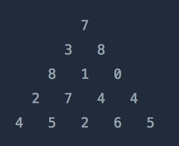

# Dynamic Programming

### Dynamic Programming

* 수 많은 조합을 계산하기에는 시간이 너무 오래 걸리기에 중복되는 연산을 저장해두어 연산을 줄이는 방식이다

### 문제 풀이 예제

프로그래머스 정수 삼각형



위와 같은 삼각형의 꼭대기에서 바닥까지 이어지는 경로 중, 거쳐간 숫자의 합이 가장 큰 경우를 찾아보려고 합니다. 아래 칸으로 이동할 때는 대각선 방향으로 한 칸 오른쪽 또는 왼쪽으로만 이동 가능합니다. 예를 들어 3에서는 그 아래칸의 8 또는 1로만 이동이 가능합니다.

삼각형의 정보가 담긴 배열 triangle이 매개변수로 주어질 때, 거쳐간 숫자의 최댓값을 return 하도록 solution 함수를 완성하세요.

### 제한사항

* 삼각형의 높이는 1 이상 500 이하입니다.
* 삼각형을 이루고 있는 숫자는 0 이상 9,999 이하의 정수입니다.
* 위의 문제를 풀기 위해 가장 먼제 DFS, BFS와 같은 탐색 알고리즘을 생각 해 볼 수 있다
* 높이 따라서 높이가 1인 경우 1가지의 경우의수
* 2 → 2
* 3 → 4
* 4 → 8
* 따라서 높이에 따라 $2^{(h-1)}$ 번의 경우의 수가 존재한다
* 높이가 최대 500 이므로 $2^{499}$ 번 이 필요하기 때문에 DFS, BFS로 풀기는 불가능하다

```python
import copy

def solution(triangle):
    answer = 0
    scores = copy.deepcopy(triangle)
    neighbors = [(-1,0),(-1,-1)]
    for i,row in enumerate(scores):
        for j, value in enumerate(row):
            for di,dj in neighbors:
                if (i + di >= 0 and i + di < len(scores) and (j+dj >= 0 and j + dj < len(row)-1)): 
                    if triangle[i][j] + scores[i+di][j+dj] > scores[i][j]:
                        scores[i][j] = triangle[i][j] + scores[i+di][j+dj]
    answer = max(scores[-1])    
        
    return answer  
```

* 위와 같이 각 높이 마다 반복문을 돌리고 각 요소 마다 가능한 경로의 최댓값 만을 저장한다
* 각 요소 방문 시 처음부터 모든 경로에 대한 값을 계산 할 필요 없이 바로 윗 줄의 값과 비교만 해주면 된다
* 1 → 1
* 2 → 1 + 2 * 2
* 3 → 1 + 2 \* 2 + 3 \* 2
* h → 1 + 2 \* 2 + 3 \* 2 + … h * 2 = 1 + 2 (2 + 3 + … h) = 대략 $O(h^2)$ 으로 볼 수 있다

### DP 문제 판별하기

* DFS, BFS로 풀 수 있지만 시간초과에 걸릴 수 있는 경우
* 경우의 수의 중복 연산이 많은 경우