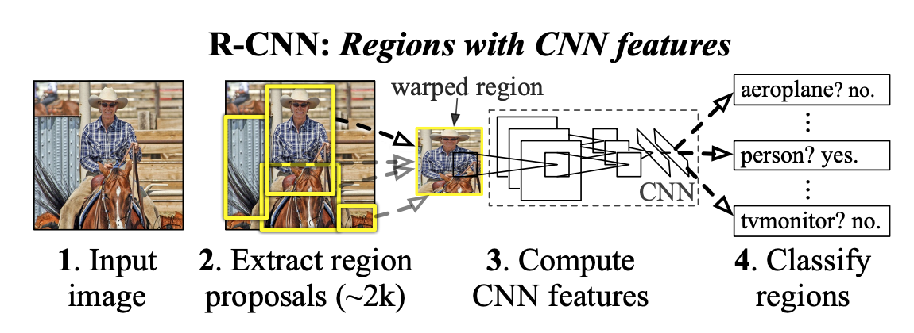
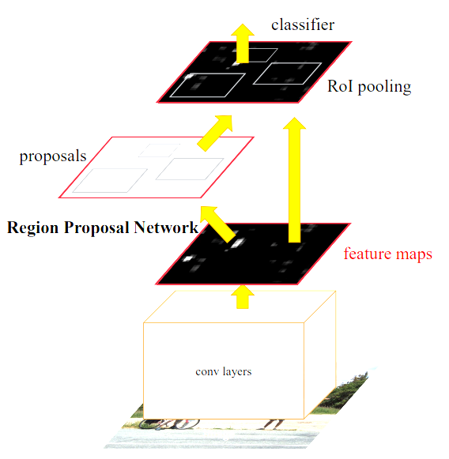
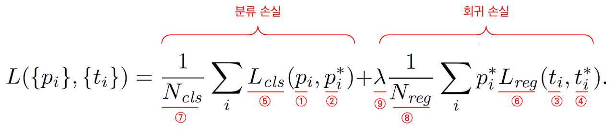

### Faster R-CNN

> 키워드 : Region Proposal Network, Region of Interest Pooling, Bounding Box Regression, Non Maximum Suppression
>
> 

* RCNN 계열의 모델은 위의 그림과 같이 Selective Search 라는 알고리즘을 통해 물체가 존재 할 만한 후보 영역을 추출하여 CNN을 사용해 classification을 진행하는 방식이었다.
* 이 때, Selective Search는 뉴럴 넷 형식이 아닌 CPU를 사용하는 알고리즘의 형태이다.
* Detection은 Real-time으로 실행될 application이 많기 때문에 R-CNN의 병목이었던 Region Proposal을 해결하고자 Faster R-CNN과 같은 모델이 나오게 되었다.

### Methods

* Faster R-CNN은 다음과 같은 순서로 진행된다

  1. CNN을 통해 이미지로 부터 **feature map**을 추출한다.
  2. feature map에 Fully Convolution을 적용하여 classification layer와 box-regression layer를 계산한다.

     1. Classification layer에서는 1x1 convolution을 채널 수 = 2 (Object 인지 아닌지) * k (앵커 개수) 만큼 진행하고 Softmax를 통해 각 앵커가 Object일 확률 값을 얻는다.
     2. Box-regression layer에서는 1x1 convolution을 채널 수 = 4 (박스 좌표) * k (앵커 개수) 만큼 진행한다.
  3. 위에서 도출된 값을 이용하여 Region of Interest (RoI)를 계산한다.

     * RoI는 서로 크기가 다른 Region Proposal들을 동일한 크기의 input으로 사용 할 수 있도록 Pooling 하는 것을 말한다.
     * 기존의 feature map에서 Region Proposal에 해당하는 부분을 RoI pooling을 통해 동일 한 크기의 텐서를 생성한다.
  4. Classification을 통해 얻은 확률 값을 높은 순서로 정렬하고 상위 K개를 선택한다.
  5. K개의 앵커들에 각각 Bounding Box Regression을 적용한다.
  6. 중복을 값을 없애주기 위해 Non-Maximum-Suppresion (NMS) 을 통해 RoI를 구한다.

     * 가장 높은 확률을 가지는 박스를 기준으로 Intersection over Union (IoU)를 계산하여 Threshold 이상인 박스들을 제거한다.

### Loss Function

* Loss function의 경우 classification loss와 regression loss로 구분된다.
* Classification loss의 경우 각 앵커 박스에 대해서 먼저 positive와 negative label로 구분한다.

  * ground truth를 기준으로 IoU가 0.7 이상인 앵커 박스는 모두 positive label를 부여한다.
  * ground truth와 IoU가 0.7 이상이 없는 경우를 대비하여 ground truth와 IoU가 가장 큰 앵커를 positive lable로 구분한다.
  * ground truth와 IoU가 0.3 이하인 경우는 negative label로 구분한다.
  * 어느 경우도 아닌 경우는 학습 과정에서 제외된다.