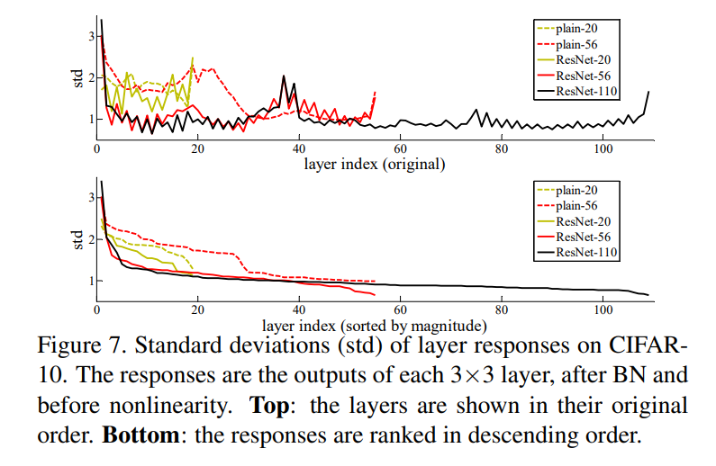
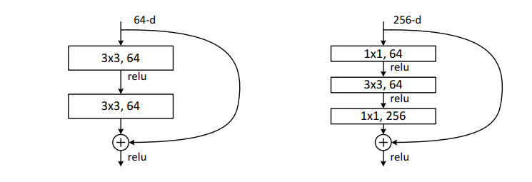
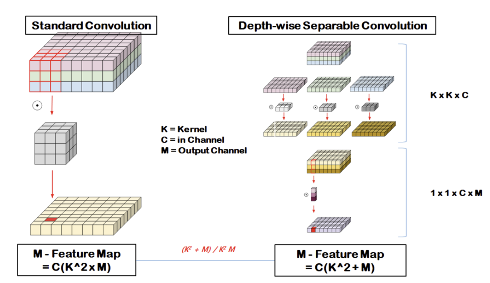

# VGGNet, ResNet, MobilNetV2

* Image Classifciation 을 위한 딥러닝 모델
* Object Detection 등과 같은 다른 Task를 위한 모델의 Backbone 모델로 많이 사용된다.

### VGGNet

> Keywords : Deeper Network, 3x3 kernels

* 이전 모델에 비해 더 많은 Layer를 사용하였다. (Deeper Network)
* 필터의 크기를 3x3으로 설정하여 (최소 단위) 네트워크를 더 깊게 구성 할 수 있도록 한다.

  * 3x3 으로 설정하는 이유는 3x3이 상하좌우 위치 정보를 인식 할 수 있는 최소 단위이다.
  * 3x3 커널을 3번 적용하는 것과 7x7 커널을 1번 적용하는 것의 결과 feature map의 크기는 동일하다.

    * 하지만, 파라미터 계산 수를 계산해 보면 3x3을 3번 적용하는 것이 더 적은 파라미터를 요구한다.

      * (3*3)*3 = 27 vs 7*7 = 49
* (Conv)+ ReLU + Pooling 구조로 이루어져 있다.
* 레이어 개수를 점점 늘려가며 실험을 해서 레이어의 깊이에 따른 성능을 비교했다.

  * 그 결과, 작은 필터로 깊게 설계하는 것이 더 성능이 좋았다는 결론

### ResNet

> Keywords : Vanishing Gradient, Skip Connection, Bottleneck

* 깊이를 더 깊게 설계 하고 싶지만 오히려 성능이 떨어지는 문제가 발생 (Vanishing Gradient)

  * 레이어가 반복될 수록 back propagation 과정에서 gradient 값이 점점 0에 가까워지는 현상
  * Activation Function 등에 의해 발생
* Skip conncetion을 통해 기존 정보를 보존한다.

  * 수식적으로는 $y = F(x) + x$
  * 이상적인 함수가 Identity일 때 특히 학습이 쉬워진다

    * 이는 실험에서 F가 대부분 매우 작은 값을 가졌다는 것을 보이며 H(x)가 Identity에 가까운 경우가 많으며 따라서 더 최적화가 쉬워진다고 주장한다.

    
* Bottleneck 구조

  * 더 빠르고 효율적인 모델을 위해 Bottleneck 구조를 통해 연산량을 줄여준다. (오)

  

### MobileNetV2

> Keywords : Depthwise Convolution (Computation) Inverted Residual (Memory)

* 모바일 및 임베디드 환경에 맞출 수 있는 모델 설계
* Depthwise Seperable Convolution

  * Depthwise + Pointwise Convolution으로 구성
  * Depthwise는 각 채널 마다 따로 Convolution을 진행

    * Output 채널 수 : N, Input 채널 수 : M
    * 기존 : (3*3*M) * N
    * Depthwise: (3*3*M), PointWise : (1*1*M*N)

  
* Inverted Residual

  * Bottleneck 구조를 반대로 사용 narrow → wide → narrow
  * narrow에 해당하는 layer에 중요한 정보가 압축되어 있다는 가정
  * 따라서 skip connection 사용 시 더 중요한 정보를 전달 가능 + 메모리 용량

### 모델 구현 및 학습 with CIFAR10

<https://github.com/sangyun0521/deeplearning-models>

<!-- notionvc: a3e53840-3e6b-4abe-af5e-91ab0c22903b -->

<!--EndFragment-->