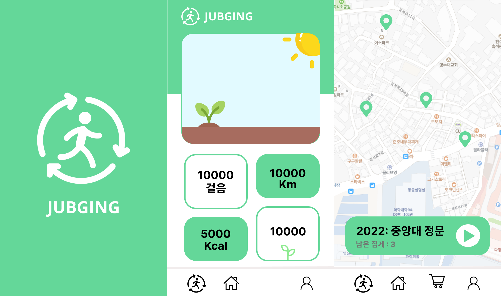

# Jubging (줍깅)

<a href="https://github.com/JUBGING">
Jubging Github Link
</a>

🚮 줍깅이란, 줍다와 조깅을 결합한 단어로 거리에 버려진 쓰레기를 최대한 많이 주우며 목적지 까지 가벼운 조깅으로 가는 환경보호 운동입니다. 줍깅 활동을 활성화 시키기 위해 줍깅 활동으로 배출한 쓰레기의 무게를 측정하는 쓰레기 통을 제작하여 배출한 무게 만큼 상점에서 사용 할 수 있는 포인트로 바꿔주는 서비스를 개발하였습니다.

### 🛠️ 사용 기술 및 라이브러리

- SpringBoot (Java)
- Android Studio (Kotlin)
- Arduino (C)
- EC2, RDS

### 🎮 담당한 기능

- 백엔드 API 개발
- EC2 서버 배포
- 프론트 엔드 개발 (무게 표시, 블루투스 연결, 줍깅 완료 화면 및 API 연결)
- Arduino 개발 (블루투스 모듈, 무게 센서, 서보 모터)
