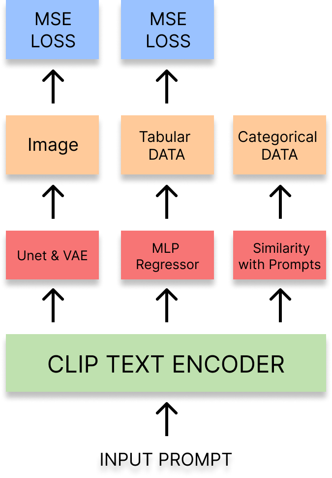
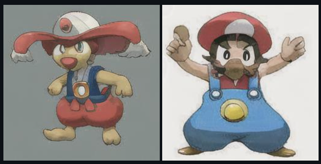

# Pokemon Generator

<a href="https://github.com/99kenny/Pokemon-Generator">
    Pokemon Generator Github Link
</a>

| Height | Weight | Attack | Defense | SP Attack | SP Defense |
| :----: | :----: | :----: | :-----: | :-------: | :--------: |
|  0.7   |  34.8  |   66   |   37    |    50     |     92     |

<aside>
🤖 Pokemon Generator는 Stable Diffusion 모델을 활용하여 세상에 없는 새로운 포켓몬을 생성하는 모델입니다. Prompt를 입력하여 원하는 포켓몬 이미지와 그에 적절한 특성 값들을 생성합니다.

</aside>

### 🛠️사용 기술 및 라이브러리

- PyTorch
- Stable Diffusion
- LoRA (Low Rank Adaptation)

### 🎮담당한 기능

- Selenium을 활용한 Data Crawling
- Data Preprocessing
- Stable Diffusion fine-tuning with Low Rank Adaptation (LoRA)
- Prompt Engineering
