# Visual Prompt Tuning

_학부연구생 프로젝트 (2023.09 ~ 2023.12)_

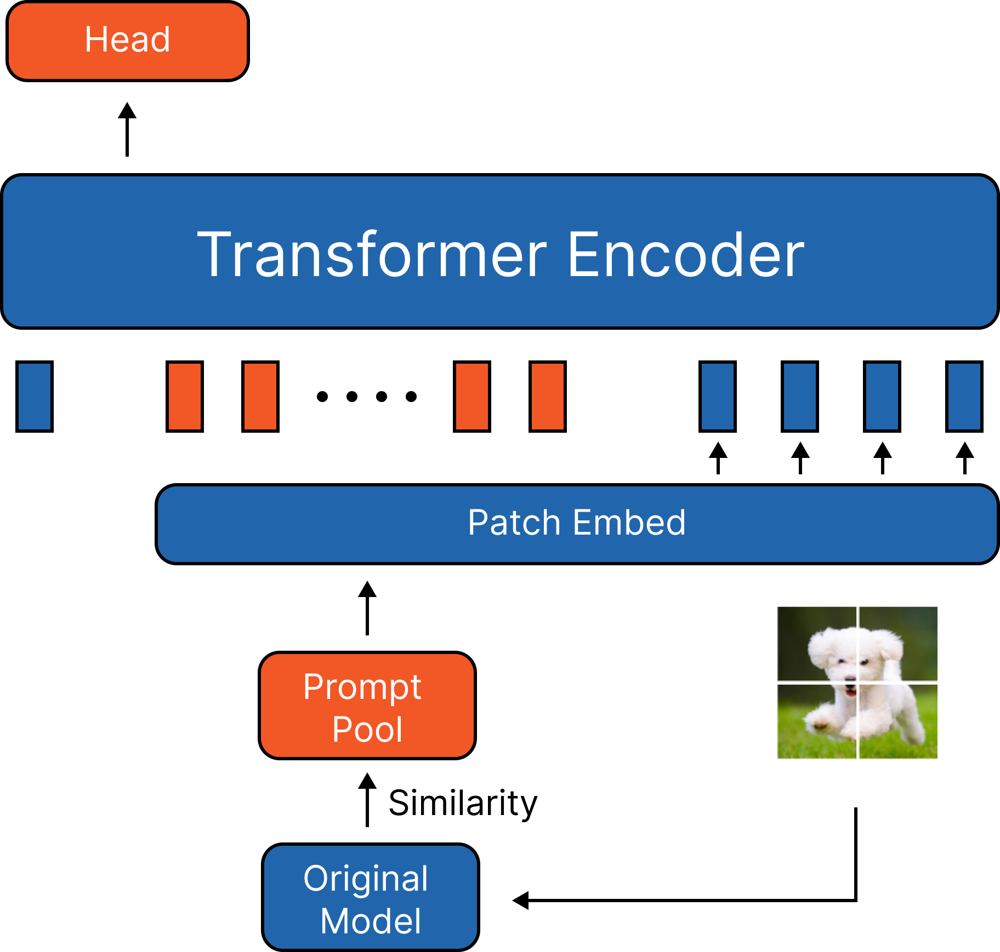

### Visual Prompt Tuning

컴퓨터 비전 모델 (ViT)에서 Prompt Tuning은 단순 숫자 형태의 vector를 prompt로 사용한다.

숫자 형태의 prompt를 사용 할 경우 다음과 같은 문제가 있다.

- Explainability 부족 : Prompt Tuning을 통해 성능이 좋은 Prompt를 얻어도 단순 숫자 벡터로 표현되기 때문에 explainability가 부족하다
- 이미지의 형태가 아니기 때문에 ViT 모델의 모든 컴포넌트를 통해 학습 할 수 없다 : Patch Embedding Layer를 포함하지 않고 prompt가 학습된다.

이에 따라 이미지 형태의 prompt를 학습하여 Visualize된 형태의 prompt를 통해 prompt에 대한 explainability를 부여하고 ViT 모델의 모든 layer를 활용하여 학습이 되도록 하여 prompt의 성능을 개선한다.

### Original Model

- Continual learning setting에서 L2P 모델을 base 비교 모델로 선정
- Accuracy : 83.86%, Forgetting : 7.63%

### Image Prompt

단순 가능성 확인을 위해 이미지 형태로 prompt initialize

Patch Embedding Layer를 포함 할 경우

- Accuracy : 74%, Forgetting : 11.91%
- 이미지 크기 이슈
  - CIFAR100 데이터 셋으로 학습 할 경우 32x32 크기를 224x224 크기로 resize해주어야 한다
- Patch Embedding Layer 이슈
  - Patch Embedding Layer를 통과하게 되면 Prompt의 개수가 너무 많아진다.
  - 기존 방식 대비 거의 10배 가까이 Prompt가 생성되어 오히려 학습에 방해가 되는 것으로 예상

Patch Embeeding Layer를 포함하지 않는 경우

- Accuracy : 84.3%, Forgetting : 6.53%
  

- Prompt의 개수, Dimension 모두 L2P와 동일하게 맞춰주기 위해 이미지의 dimension 변형을 진행
- 이미지 형태가 더 나은 Initialization 성능이라는 것을 알게됨
- 이 방식은 이미지의 Dimension을 유지하는 방식이 아니기 때문에 이미지 형태의 Prompt를 하기는 불가능

1. 생성형 AI를 통해 이미지 형태의 Prompt를 생성하는 방식을 시도
2. 데이터의 각 class 별 선택되는 이미지 Prompt의 경향성을 분석

### Generator Prompt

생성형 AI 모델을 사용해 Prompt를 생성 할 수 있는 방식으로 시도

1. Image Prompt Generator

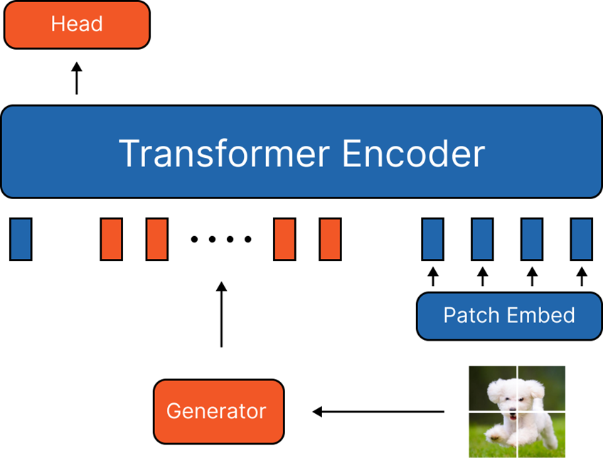
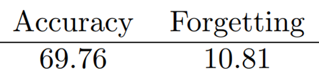

- VAE 모델을 사용하여 Training 이미지를 생성하도록 학습
- 모델이 추가 되는 경우 학습이 더 어려움 + Forgetting이 발생
- Training 이미지의 분포와 성능이 좋은 Prompt의 분포가 다를 가능성

2. CLS Token Generator

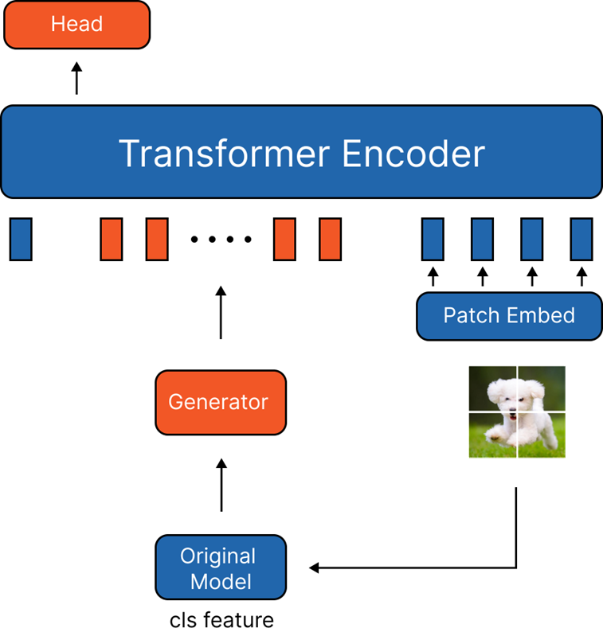
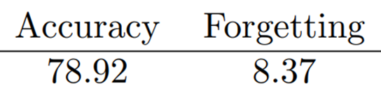

- Training 이미지 보다 더 적은 차원을 사용하는 CLS 토큰을 사용
- 학습이 더 잘되는 모습
- 그러나 기존 방식에 비해 성능은 많이 낮은 모습

따라서, 기존 방식인 Prompt Pool과 함께 VAE 모델을 사용하는 방식으로 변형

3. Generator with Prompt Pool

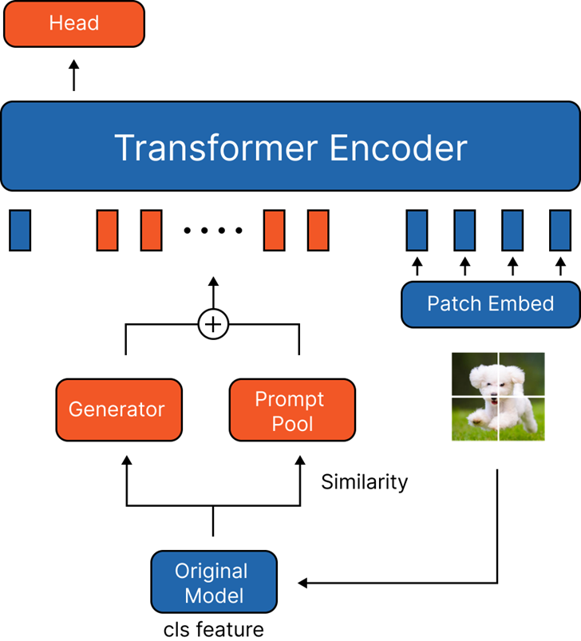
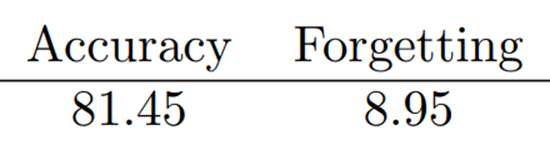

- Generator를 사용한 방식 중 가장 성능이 좋음
- Generator를 더 최적화하면 성능 향상이 기대됨
- Generator에 대한 Forgetting을 줄여주기 위해 LwF 적용

4. Generator with Prompt Pool (LwF)

**Generator with Prompt Pool**
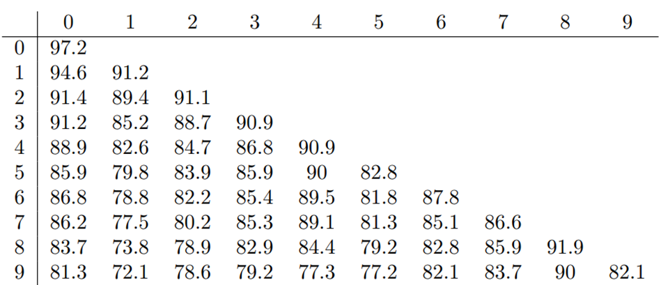

**Generator with Prompt Pool (LwF)**
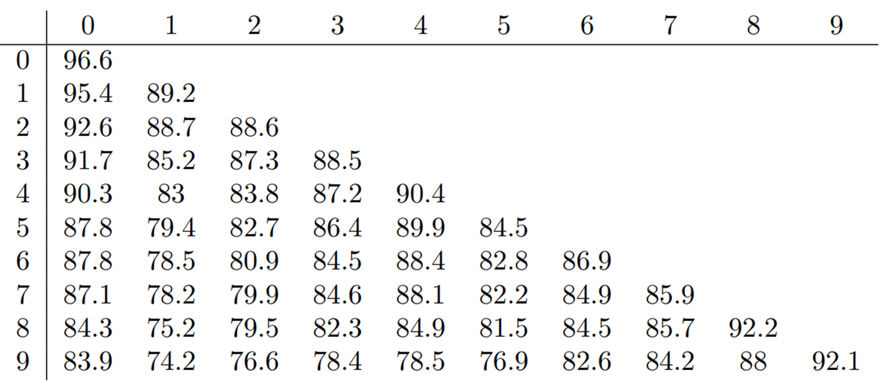

- 각 Task 별 성능을 나타낸 표
- 가로 축은 각 task를 의미
- 세로 축은 해당 task 까지 학습 되었음을 의미
- Ex) 위에서 3번째 줄은 2번 task까지 학습 되었음을 의미하며 각 인덱스는 해당 Task에 해당하는 성능을 나타냄
- LwF 사용시 새로운 Task에 대한 성능이 떨어짐 (LwF의 Regularization 때문)
- 기존 Task의 Forgetting은 감소
- 성능의 감소와 Forgetting의 감소가 Trade Off 되어 적절한 LwF의 Weigth를 적용해주어야 함

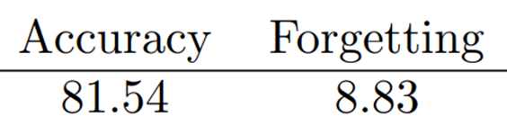

### 경향성 분석

Generator 모델이 생성한 이미지 형태의 Prompt가 특정 Class에서 선택된 빈도를 분석

- Prompt는 Training Image로 부터 initialized
- 왼쪽 부터 순서대로 0~9번 Prompt
- Apple, Boy, Maple, Mountain, Bee, Chair, Lion, Poppy, Crab, Bus

**Apple**
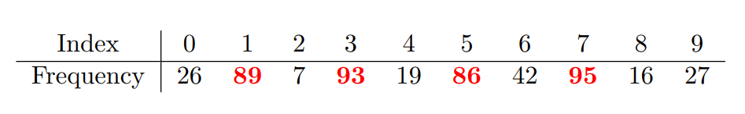

**Baby**
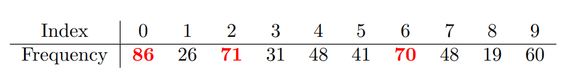

- Apple의 경우 Boy, Mountain, Chair, Poppy 가 가장 많이 선택 되었음
- 0번 Apple이 가장 많이 선택 되는 것을 기대했지만 결과는 그렇지 않음
- 각 class가 크게 다르지 않은 CIFAR100의 문제?

### Results

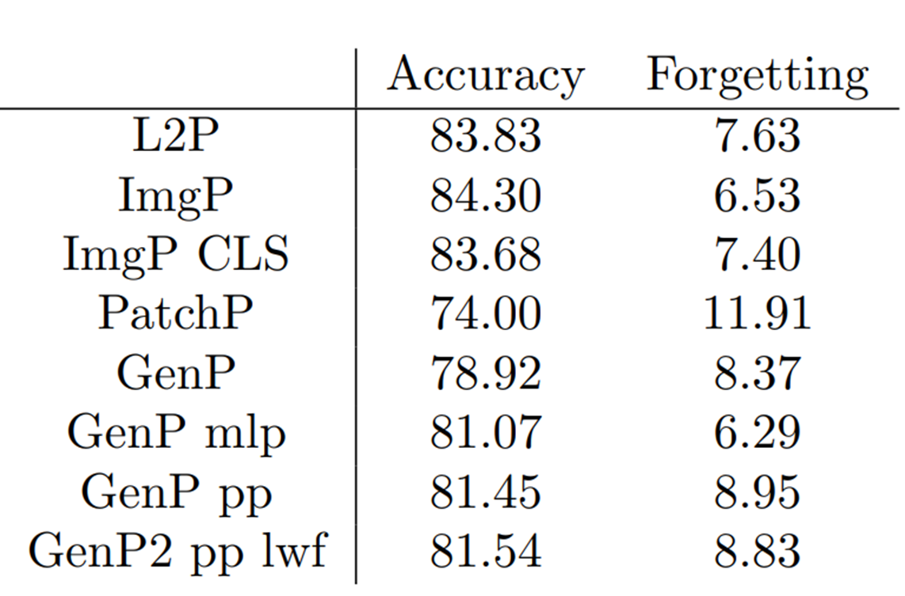

- 이미지 형태로 Prompt를 학습하여 ViT 모델의 모든 Layer를 사용하여 성능 향상을 목표로 하였지만 Patch Embedding Layer를 사용시 이미지 Dimension과 Prompt Length가 맞지 않는 문제가 발생
- 이미지 형태로 Prompt를 학습하여 Causal Inference 진행을 목표로 했지만 Class 별 Prompt 선택되는 Frequency에서 유의미한 관계성을 찾지 못하였음
- 차선책으로 Prompt Generator와 Prompt Pool을 함께 사용하여 성능 향상을 목표로 학습하였으나 성능이 잘 나오지 않았음
- Generator 모델에 대한 최적화가 필요
